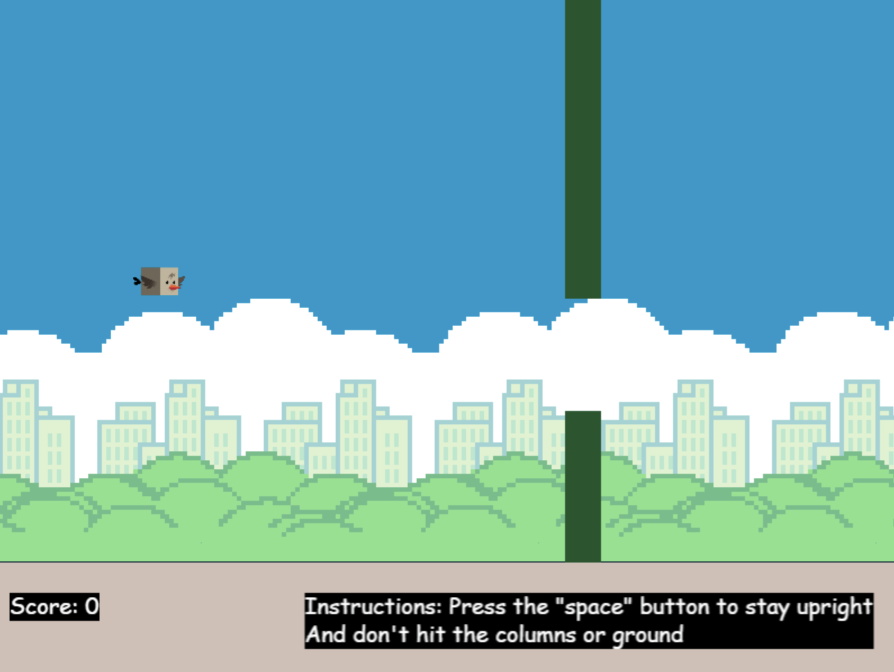

# Floppy Beard

A **Flappy Bird clone game** built using **JavaScript** and **Phaser 3**. Guide your bird through randomly generated columns and try to achieve the highest score!  

## Features

- Physics-based bird movement with **gravity** and **collision detection**  
- Animated bird using multiple PNG frames  
- Randomly generated columns with configurable gaps  
- Scoring system that increases when passing through columns  
- Game reset functionality via **space bar**  

## Technologies Used

- **JavaScript (ES6)**  
- **Phaser 3** for game engine and physics  
- HTML/CSS for displaying the game canvas  

## How to Play

### Option A
1. Open `index.html` in a web browser.  
2. Press **space** to start the game.  
3. Press **space** to make the bird flap and stay airborne.  
4. Avoid hitting columns and the ground.  
5. Your score increases every time you pass between columns.  
6. If you crash, press **space** to restart.  

### Option B
1. Visit Vrospix.github.io/floppy_beard/index.html
2. Play and have fun! :D

## Setup

1. Clone this repository:
   ```bash
   git clone https://github.com/yourusername/floppy_beard.git
   ```
2. Open `index.html` in a browser that supports HTML5 Canvas.

## Screenshots

